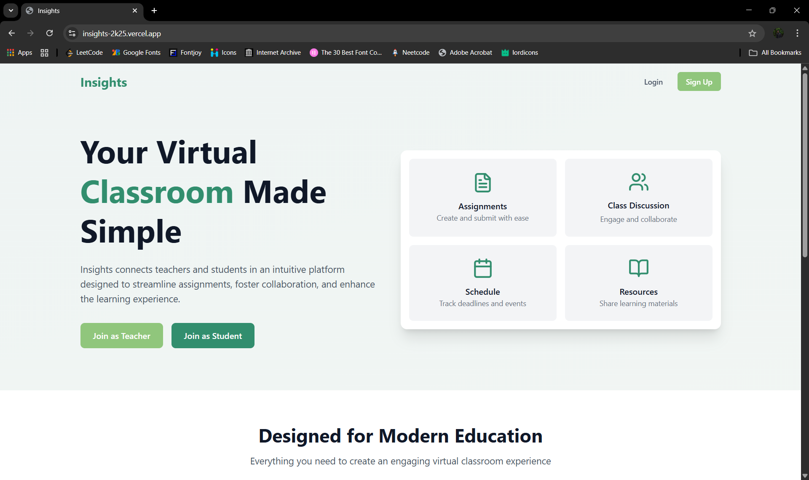
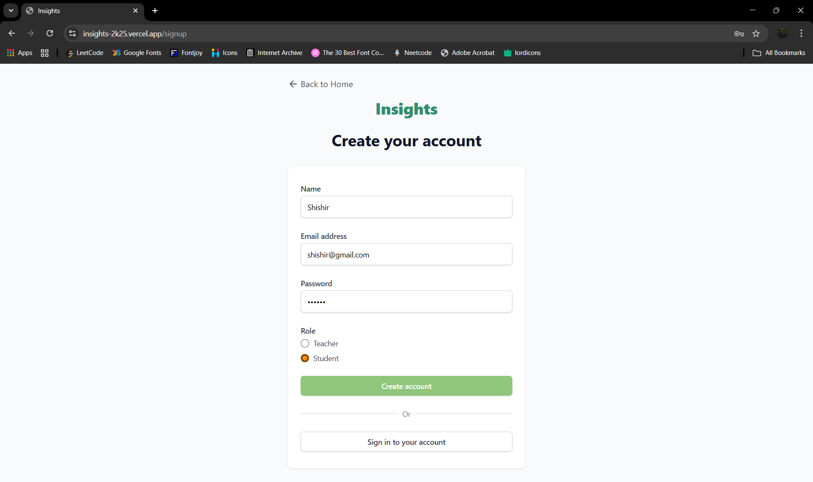
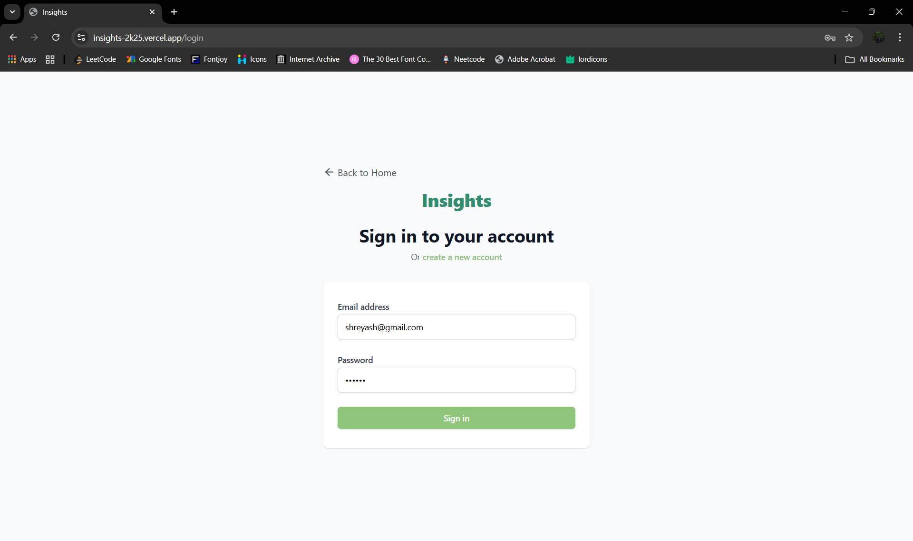
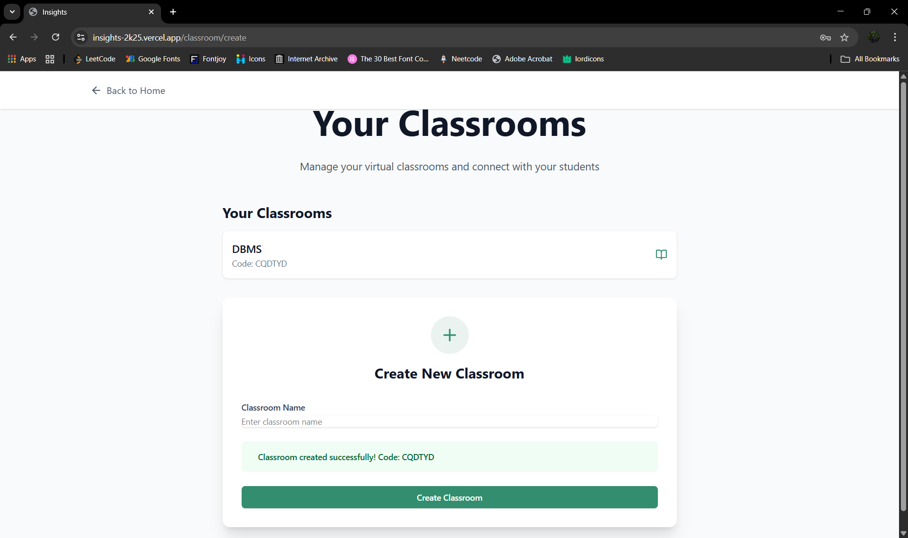
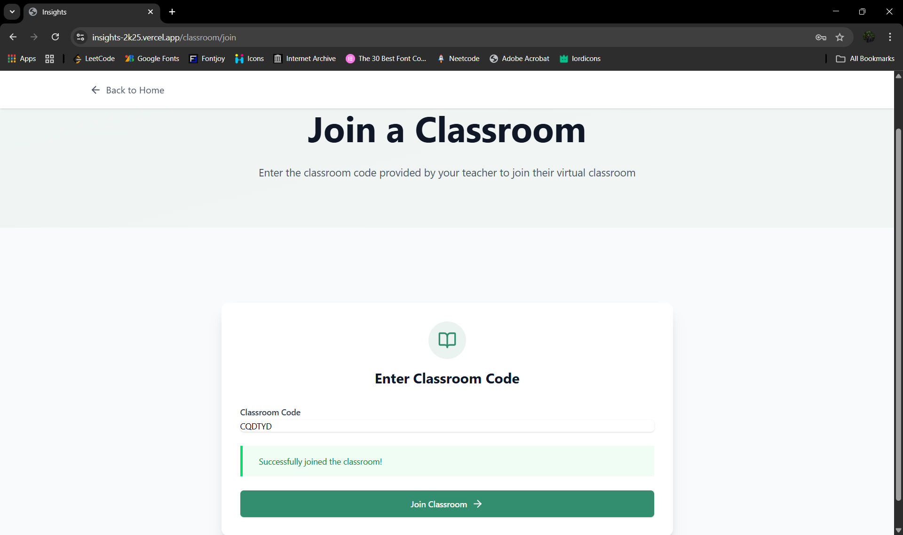
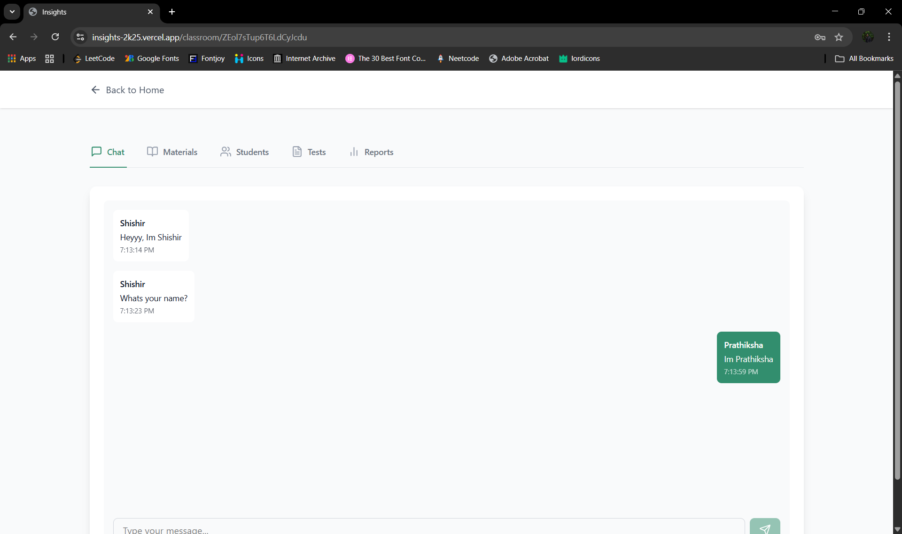
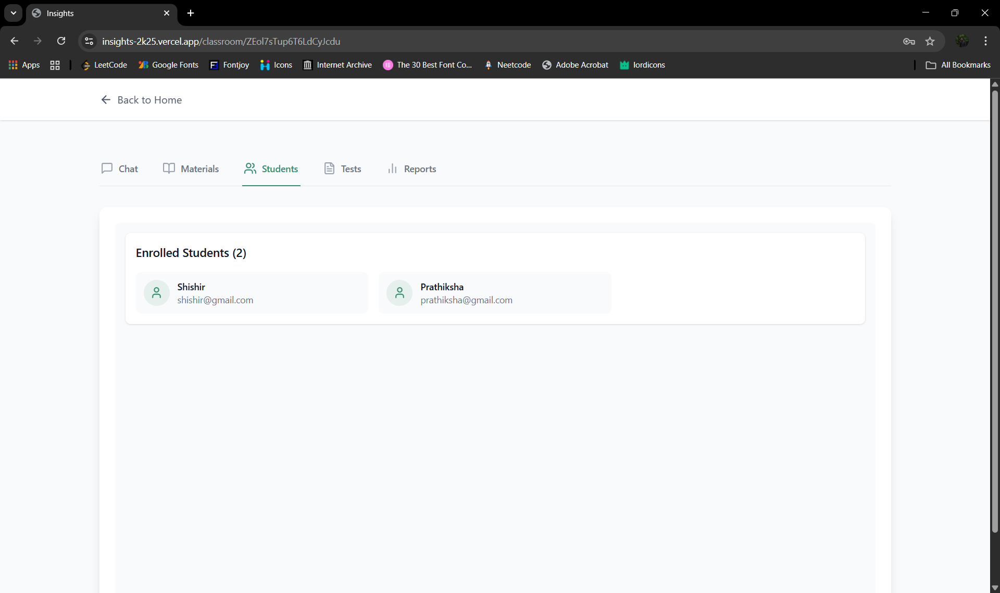
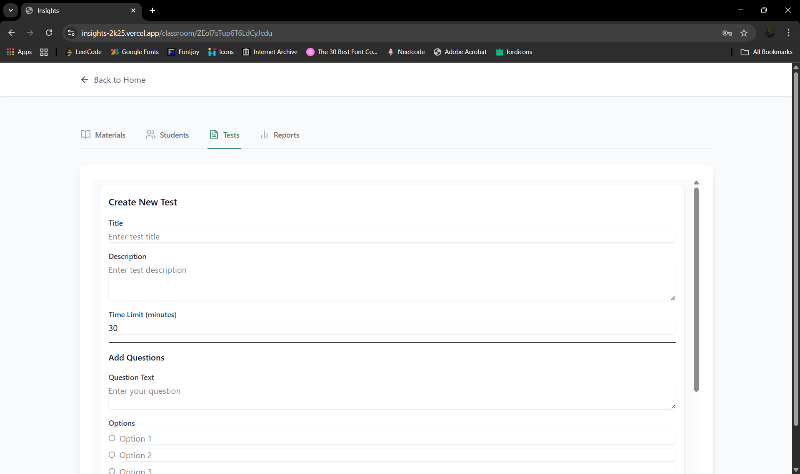
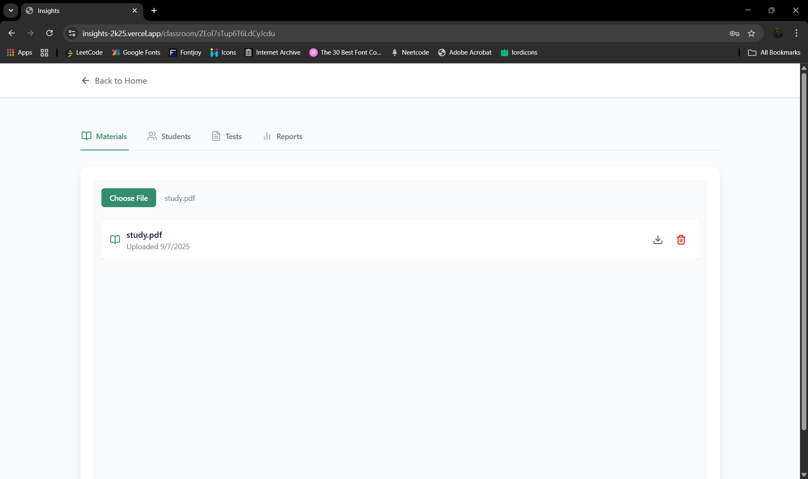
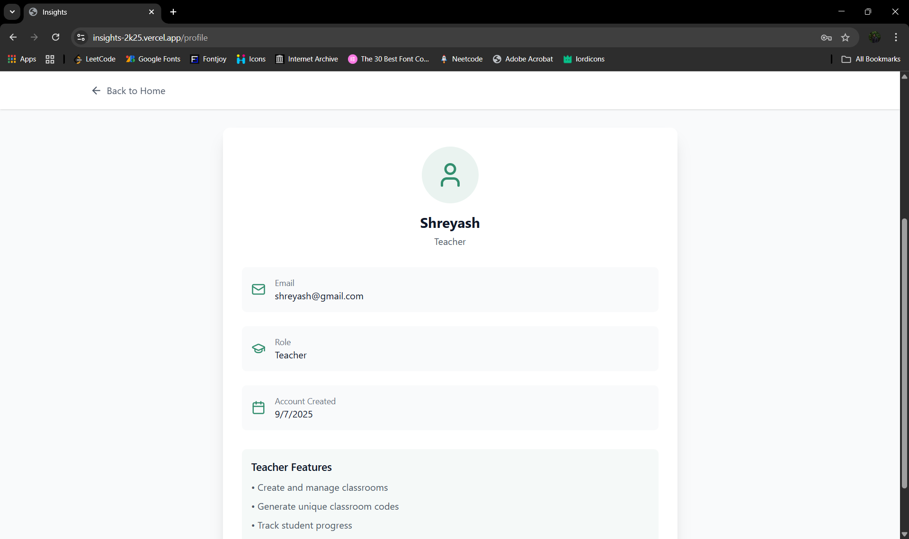

# 🎓 Insights

Insights is a **virtual classroom platform** designed to enhance the online learning experience.
Students can interact with peers and teachers, while teachers can manage assignments, tests, and classroom activities — all in one place.

---

## 📸 Screenshots

|  |
|:--:|

|  |  |  |
|:--:|:--:|:--:|

|  |  |  |
|:--:|:--:|:--:|

|  |  |  |
|:--:|:--:|:--:|

> 🖼️ Click on any image to view it in full size.

---

## ✨ Features

* 💬 Real-time chat for students to collaborate and discuss.
* 📂 Teachers can upload and manage assignments.
* 📝 Conduct and manage tests seamlessly.
* 👩‍🏫 Virtual classroom environment with interactive tools.
* 🎨 Modern and responsive UI built with **React 19** and **TailwindCSS 4**.
* ☁️ Secure data storage and authentication with **Firebase**.

---

## 🚀 Tech Stack

* **Frontend:** React 19
* **Styling:** TailwindCSS 4 (customized for clean UI)
* **Backend & Hosting:** Firebase (Authentication, Firestore, Storage), Vercel
* **Database:** NeonDB (PostgreSQL)
* **Other:** ESLint setup, Environment Variables support

---

## 🛠️ Setup Instructions

Clone the repository and get started!

```bash
# 1. Clone the repo
git clone https://github.com/programmingwithshishir/insights.git
cd insights

# 2. Install dependencies
npm install

# 3. Start the development server
npm run dev
```

---

## 🗄️ Database Setup (NeonDB)

Run the following SQL commands to create the required tables:

### Table: `reports`

```sql
CREATE TABLE reports (
    id SERIAL PRIMARY KEY,
    classroom_id TEXT NOT NULL,
    test_id TEXT NOT NULL,
    student_id TEXT NOT NULL,
    student_name TEXT NOT NULL,
    test_title TEXT NOT NULL,
    file_name TEXT NOT NULL,
    file_data BYTEA NOT NULL,
    score NUMERIC NOT NULL,
    total_questions INTEGER NOT NULL,
    correct_answers INTEGER NOT NULL,
    time_spent INTEGER NOT NULL,
    created_at TIMESTAMP DEFAULT CURRENT_TIMESTAMP,
    CONSTRAINT reports_classroom_id_test_id_student_id_key UNIQUE (classroom_id, test_id, student_id)
);
```

### Table: `materials`

```sql
CREATE TABLE materials (
    id SERIAL PRIMARY KEY,
    classroom_id TEXT NOT NULL,
    file_name TEXT NOT NULL,
    file_data BYTEA NOT NULL,
    uploaded_by TEXT NOT NULL,
    uploaded_at TIMESTAMP DEFAULT CURRENT_TIMESTAMP
);
```

---

# React + Vite

This template provides a minimal setup to get React working in Vite with HMR and some ESLint rules.

Currently, two official plugins are available:

* [@vitejs/plugin-react](https://github.com/vitejs/vite-plugin-react/blob/main/packages/plugin-react) uses [Babel](https://babeljs.io/) for Fast Refresh
* [@vitejs/plugin-react-swc](https://github.com/vitejs/vite-plugin-react/blob/main/packages/plugin-react-swc) uses [SWC](https://swc.rs/) for Fast Refresh

## Expanding the ESLint configuration

If you are developing a production application, we recommend using TypeScript with type-aware lint rules enabled. Check out the [TS template](https://github.com/vitejs/vite/tree/main/packages/create-vite/template-react-ts) for information on how to integrate TypeScript and [`typescript-eslint`](https://typescript-eslint.io) in your project.
